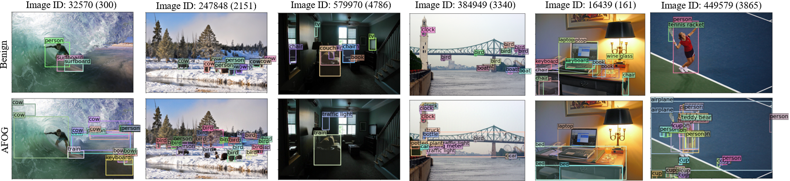

# Adversarial Attention Perturbations for Large Object Detection Transformers

This is the official implementation of the paper "Adversarial Attention Perturbations for Large Object Detection Transformers (ICCV 2025)"



Adversarial perturbations are useful tools for gaining a deeper understanding of large transformer-based object detection models. Existing adversarial perturbation methods are limited to attacking regression-based object detectors (be it two-stage proposal-based or single-stage detectors). This paper presents an attention-focused offensive gradient (AFOG) attack with dual objectives: AFOG is an adversarial perturbation method targeted at vision transformer models for object detection; and the AFOG adversarial perturbation framework is neural-architecture agnostic and effective for attacking both large transformer-based object detectors and conventional regression-based detectors. First, AFOG utilizes a learnable attention mechanism that focuses perturbations on vulnerable areas of feature maps in multi-box detection tasks. Second, AFOG’s attack loss is formulated by integrating two types of feature loss through learnable feature-map based attention updates with iterative injection of adversarial perturbations. Finally, AFOG is an efficient and stealthy adversarial perturbation method, and it probes the weak spots of detection-transformers by adding strategically generated and yet visually imperceptible perturbations, which can cause well-trained vision models to fail on their object detection tasks. To the best of our knowledge, AFOG is the first method that can attack both advanced transformer-based object detection models and traditional regression-based object detectors through a unified attention-based attack framework. Extensive experiments conducted with twelve large detection transformers on COCO demonstrate the efficacy of AFOG. Our empirical results also show that AFOG outperforms the existing attacks on regression-based objet detectors.

## Setup and Dependencies
This project uses Python 3.12.4 with PyTorch 2.5.0 and CUDA 12.4 on an NVIDIA A100 GPU. Other versions and hardware are not guaranteed to function properly. To run our code, following these steps (note that initial steps are different depending on model):

#### Transformers and FRCNN

1. Create and activate a virtual environment.
```
conda create -n AFOG python=3.12.4
conda activate AFOG
```
2. Download and unzip or clone our repository.
3. Install required packages and build Detrex, Detectron2. Note: this must be done on a machine with direct access to CUDA. i.e. if you are using slurm, be sure to install dependencies, install pytorch, and build detectron2 and detrex on a GPU-enabled device. 
```
pip install -r requirements.txt
conda install pytorch==2.5.0 torchvision==0.20.0 torchaudio==2.5.0 pytorch-cuda=12.4 -c pytorch -c nvidia
pushd models/detrex
python -m pip install -e detectron2
pip install -e .
popd
```

#### SSD and YOLO

1. Create and activate a virtual environment.
```
conda create -n AFOG_Reg python=3.9.18
conda activate AFOG_Reg
```
2. Download and unzip or clone our repository.
3. Install required packages.
```
pip install -r requirements_reg.txt
```

#### All Transformer Models
4a. If exploring transformers, download and unzip [COCO Annotations](http://images.cocodataset.org/annotations/annotations_trainval2017.zip) and [COCO Images](http://images.cocodataset.org/zips/val2017.zip) to locations:
```
<top_level_name>/datasets/coco/annotations/
<top_level_name>/datasets/coco/val2017/
```

4b. If exploring regression-based detectors, download and unzip [VOC](http://host.robots.ox.ac.uk/pascal/VOC/voc2007/VOCtest_06-Nov-2007.tar) to locations:

```
<top_level_name>/datasets/VOCDevKit/VOC2007/JPEGImages
<top_level_name>/datasets/VOCDevKit/VOC2007/Annotations
```

5. Download and unzip models as necessary so that each is either .pth or .h5. Store them in:
```
<top_level_name>/model_files/example_model.pth
```

Model Files:
* [DETR-R50](https://dl.fbaipublicfiles.com/detr/detr-r50-e632da11.pth)
* [DETR-R101](https://dl.fbaipublicfiles.com/detr/detr-r101-2c7b67e5.pth)
* [Deformable DETR](https://drive.google.com/file/d/1nDWZWHuRwtwGden77NLM9JoWe-YisJnA/view?usp=sharing)
* [ResNet-50](https://github.com/IDEA-Research/detrex-storage/releases/download/v0.2.0/dino_r50_4scale_12ep_49_2AP.pth)
* [AlignDETR](https://drive.google.com/file/d/1zQYe78fDdCmK3nwbAWYLvGCdQCFsTqoX/view?usp=share_link)
* [ViTDet](https://github.com/IDEA-Research/detrex-storage/releases/download/v0.2.1/dino_vitdet_base_4scale_50ep.pth)
* [ConvNeXt](https://github.com/IDEA-Research/detrex-storage/releases/download/v0.4.0/dino_convnext_large_384_4scale_12ep.pth)
* [Swin-L](https://drive.google.com/drive/folders/1qD5m1NmK0kjE5hh-G17XUX751WsEG-h_?usp=sharing)
* [InternImage](https://github.com/IDEA-Research/detrex-storage/releases/download/v0.4.0/dino_internimage_large_4scale_12ep.pth)
* [FocalNet](https://github.com/IDEA-Research/detrex-storage/releases/download/v0.2.1/dino_focalnet_large_lrf_384_fl4_5scale_12ep.pth)
* [EVA](https://huggingface.co/IDEA-CVR/DINO-EVA/resolve/main/dino_eva_01_o365_finetune_1280_lsj_augmentation_4scale_12ep.pth)
* [DETA](https://github.com/IDEA-Research/detrex-storage/releases/download/v0.3.0/converted_deta_swin_o365_finetune.pth)
* [Faster R-CNN](https://github.com/git-disl/TOG/releases/download/pm-v1.0/FRCNN.pth)
* [SSD-300](https://github.com/git-disl/TOG/releases/download/pm-v1.0/SSD300.h5)
* [YOLO-v3](https://github.com/git-disl/TOG/releases/download/pm-v1.0/YOLOv3_Darknet53.h5)


## Instructions
We provide two means of running AFOG on a variety of models. First, we provide Jupyter notebooks for deploying AFOG against a single COCO image and visualizing the results. Second, we provide Slurm scripts for running AFOG on the entire COCO 2017 test-dev set and logging the results.

#### AFOG on a Single Image
Before running these notebooks, be sure to link the Conda environment kernel with Ipykernel:

```
conda activate <AFOG or AFOG_Reg>
conda install ipykernel                                    
ipython kernel install --user --name=<AFOG or AFOG_Reg>
```

We provide the following demo notebooks:

Visualize AFOG attack on DETR and self-attention weight analysis:
```
demos/visualize_detr.ipynb
```
Visualize AFOG attack on Swin-L:
```
demos/visualize_swin.ipynb
```
Visualize AFOG attacks on Detrex models:
```
demos/visualize_detrex.ipynb
```
Visualize AFOG attack on Faster R-CNN and compare with TOG:
```
demos/visualize_frcnn.ipynb
```
Visualize AFOG attack on SSD-300:
```
demos/visualize_ssd300.ipynb
```
Visualize AFOG attack on YOLO-v3:
```
demos/visualize_ssd300.ipynb
```

#### AFOG on COCO:
We provide Slurm scripts for running AFOG through the entire COCO test-dev set on each model with configurable attack parameters and modes. Each script follows the general format `<model_name>_job.sbatch`. For example, to evaluate generic AFOG on ViTDet, the command would simply be:
```
sbatch scripts/vitdet_job.sbatch
```


## Acknowledgement
This project is developed based on the following repositories:
* [idea-research/detrex](https://github.com/IDEA-Research/detrex/tree/main?tab=readme-ov-file)
* [facebookresearch/detr](https://github.com/facebookresearch/detr)
* [git-disl/tog](https://github.com/git-disl/TOG/tree/master)
* [qqwweee/keras-yolo3](https://github.com/qqwweee/keras-yolo3)
* [pierluigiferrari/ssd_keras](https://github.com/pierluigiferrari/ssd_keras)
* [chenyuntc/simple-faster-rcnn-pytorch](https://github.com/chenyuntc/simple-faster-rcnn-pytorch)
